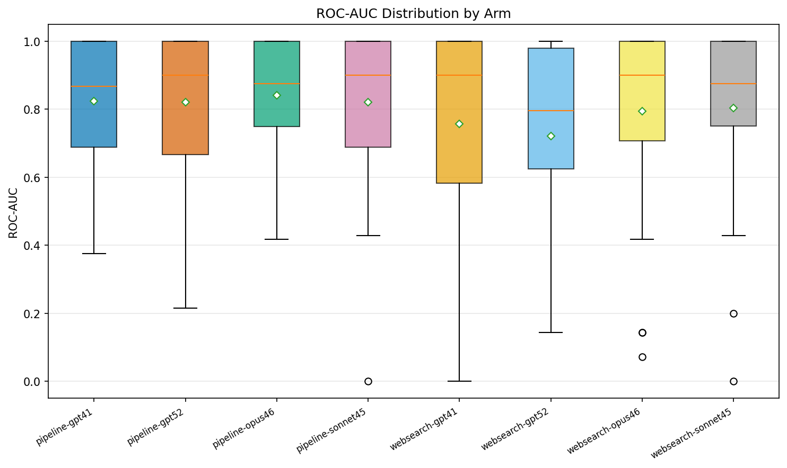

# Drug-Disease Prediction Experiment Report

**Generated**: 2026-02-15 17:36 UTC

## Experiment Summary

| Parameter | Value |
|-----------|-------|
| Drugs evaluated | 50 |
| Arms | 8 |
| Wall-clock time | 532.8s |
| Cached results | 400 |

**Difficulty distribution**:
Easy: 15, Medium: 22, Hard: 13

## Accuracy Metrics (All Drugs)

| Arm | N | P@1 | P@10 | R@1 | R@10 | AUC |
|-----|---|-----|------|-----|------|-----|
| pipeline-gpt41 | 50 | 0.800 | 0.482 | 0.051 | 0.115 | 0.823 |
| pipeline-gpt52 | 50 | 0.800 | 0.525 | 0.051 | 0.107 | 0.820 |
| pipeline-opus46 | 44 | 0.841 | 0.361 | 0.056 | 0.158 | 0.841 |
| pipeline-sonnet45 | 50 | 0.760 | 0.401 | 0.047 | 0.154 | 0.820 |
| websearch-gpt41 | 50 | 0.540 | 0.300 | 0.035 | 0.091 | 0.757 |
| websearch-gpt52 | 46 | 0.587 | 0.307 | 0.040 | 0.099 | 0.721 |
| websearch-opus46 | 50 | 0.620 | 0.234 | 0.044 | 0.111 | 0.795 |
| websearch-sonnet45 | 50 | 0.620 | 0.303 | 0.039 | 0.104 | 0.804 |

## Accuracy by Difficulty

### Easy

| Arm | N | P@10 | R@10 |
|-----|---|------|------|
| pipeline-gpt41 | 15 | 0.580 | 0.116 |
| pipeline-gpt52 | 15 | 0.667 | 0.102 |
| pipeline-opus46 | 12 | 0.405 | 0.133 |
| pipeline-sonnet45 | 15 | 0.456 | 0.137 |
| websearch-gpt41 | 15 | 0.422 | 0.102 |
| websearch-gpt52 | 15 | 0.588 | 0.155 |
| websearch-opus46 | 15 | 0.373 | 0.141 |
| websearch-sonnet45 | 15 | 0.433 | 0.110 |

### Medium

| Arm | N | P@10 | R@10 |
|-----|---|------|------|
| pipeline-gpt41 | 22 | 0.450 | 0.098 |
| pipeline-gpt52 | 22 | 0.489 | 0.091 |
| pipeline-opus46 | 21 | 0.333 | 0.147 |
| pipeline-sonnet45 | 22 | 0.378 | 0.154 |
| websearch-gpt41 | 22 | 0.266 | 0.096 |
| websearch-gpt52 | 22 | 0.242 | 0.100 |
| websearch-opus46 | 22 | 0.182 | 0.103 |
| websearch-sonnet45 | 22 | 0.271 | 0.115 |

### Hard

| Arm | N | P@10 | R@10 |
|-----|---|------|------|
| pipeline-gpt41 | 13 | 0.421 | 0.142 |
| pipeline-gpt52 | 13 | 0.423 | 0.141 |
| pipeline-opus46 | 11 | 0.367 | 0.208 |
| pipeline-sonnet45 | 13 | 0.375 | 0.173 |
| websearch-gpt41 | 13 | 0.217 | 0.072 |
| websearch-gpt52 | 9 | 0.000 | 0.000 |
| websearch-opus46 | 13 | 0.162 | 0.089 |
| websearch-sonnet45 | 13 | 0.205 | 0.077 |

## Statistical Significance (Paired Wilcoxon)

Bonferroni-corrected p-values for pairwise comparisons on P@10.

| Arm A | Arm B | Statistic | Raw p | Corrected p | Significant? |
|-------|-------|-----------|-------|-------------|-------------|
| pipeline-gpt41 | pipeline-gpt52 | 180.5 | 0.1183 | 1.0000 | No |
| pipeline-gpt41 | pipeline-opus46 | 111.5 | 0.0015 | 0.0412 | Yes |
| pipeline-gpt41 | pipeline-sonnet45 | 196.0 | 0.1310 | 1.0000 | No |
| pipeline-gpt41 | websearch-gpt41 | 69.0 | 0.0118 | 0.3316 | No |
| pipeline-gpt41 | websearch-gpt52 | 26.0 | 0.0055 | 0.1535 | No |
| pipeline-gpt41 | websearch-opus46 | 64.0 | 0.0000 | 0.0007 | Yes |
| pipeline-gpt41 | websearch-sonnet45 | 140.0 | 0.0014 | 0.0396 | Yes |
| pipeline-gpt52 | pipeline-opus46 | 177.0 | 0.0006 | 0.0167 | Yes |
| pipeline-gpt52 | pipeline-sonnet45 | 178.0 | 0.0149 | 0.4162 | No |
| pipeline-gpt52 | websearch-gpt41 | 59.0 | 0.0006 | 0.0169 | Yes |
| pipeline-gpt52 | websearch-gpt52 | 33.5 | 0.0005 | 0.0145 | Yes |
| pipeline-gpt52 | websearch-opus46 | 24.0 | 0.0000 | 0.0001 | Yes |
| pipeline-gpt52 | websearch-sonnet45 | 111.5 | 0.0001 | 0.0017 | Yes |
| pipeline-opus46 | pipeline-sonnet45 | 204.0 | 0.1098 | 1.0000 | No |
| pipeline-opus46 | websearch-gpt41 | 113.5 | 0.0696 | 1.0000 | No |
| pipeline-opus46 | websearch-gpt52 | 85.0 | 0.1778 | 1.0000 | No |
| pipeline-opus46 | websearch-opus46 | 76.5 | 0.0005 | 0.0127 | Yes |
| pipeline-opus46 | websearch-sonnet45 | 223.5 | 0.0330 | 0.9240 | No |
| pipeline-sonnet45 | websearch-gpt41 | 102.5 | 0.0637 | 1.0000 | No |
| pipeline-sonnet45 | websearch-gpt52 | 56.0 | 0.1986 | 1.0000 | No |
| pipeline-sonnet45 | websearch-opus46 | 80.5 | 0.0004 | 0.0099 | Yes |
| pipeline-sonnet45 | websearch-sonnet45 | 142.5 | 0.0028 | 0.0772 | No |
| websearch-gpt41 | websearch-gpt52 | 48.5 | 0.0347 | 0.9729 | No |
| websearch-gpt41 | websearch-opus46 | 135.5 | 0.6785 | 1.0000 | No |
| websearch-gpt41 | websearch-sonnet45 | 96.0 | 0.7367 | 1.0000 | No |
| websearch-gpt52 | websearch-opus46 | 72.0 | 0.0768 | 1.0000 | No |
| websearch-gpt52 | websearch-sonnet45 | 91.5 | 0.2557 | 1.0000 | No |
| websearch-opus46 | websearch-sonnet45 | 256.5 | 0.0391 | 1.0000 | No |

## Evidence Quality

| Arm | Citation Validity | Chain Depth | Verifiability | Relevance | Specificity |
|-----|-------------------|-------------|---------------|-----------|-------------|
| pipeline-gpt41 | 0.960 | 2.10 | 0.724 | 0.773 | 0.921 |
| pipeline-gpt52 | 0.960 | 2.81 | 0.670 | 0.771 | 0.883 |
| pipeline-opus46 | 0.955 | 2.78 | 0.656 | 0.747 | 0.943 |
| pipeline-sonnet45 | 0.960 | 3.35 | 0.761 | 0.725 | 0.890 |
| websearch-gpt41 | 0.822 | 2.94 | 0.458 | 0.743 | 0.804 |
| websearch-gpt52 | 0.239 | 2.93 | 0.149 | 0.697 | 0.755 |
| websearch-opus46 | 0.769 | 3.29 | 0.189 | 0.736 | 0.875 |
| websearch-sonnet45 | 1.000 | 3.24 | 0.343 | 0.710 | 0.842 |

## False Negative Analysis

| Arm | Total FN | FN Rate | Name Mismatch | No Evidence | Low Retrieval | Low LLM | Below Threshold | Not in Candidates |
|-----|----------|---------|---------------|-------------|---------------|---------|-----------------|-------------------|
| pipeline-gpt41 | 1050 | 0.956 | 0.02 | 0.06 | 0.00 | 0.00 | 0.00 | 0.91 |
| pipeline-gpt52 | 1046 | 0.953 | 0.03 | 0.07 | 0.00 | 0.00 | 0.00 | 0.91 |
| pipeline-opus46 | 885 | 0.946 | 0.04 | 0.08 | 0.00 | 0.00 | 0.00 | 0.88 |
| pipeline-sonnet45 | 1029 | 0.937 | 0.03 | 0.07 | 0.00 | 0.00 | 0.00 | 0.90 |
| websearch-gpt41 | 1069 | 0.974 | 0.03 | 0.06 | 0.00 | 0.00 | 0.00 | 0.91 |
| websearch-gpt52 | 1031 | 0.988 | 0.03 | 0.08 | 0.00 | 0.00 | 0.00 | 0.89 |
| websearch-opus46 | 1067 | 0.972 | 0.04 | 0.07 | 0.00 | 0.00 | 0.00 | 0.89 |
| websearch-sonnet45 | 1057 | 0.963 | 0.03 | 0.05 | 0.00 | 0.00 | 0.00 | 0.91 |

## Plots

### Cost Bars

### Evidence Radar

### Fn Distribution

### Pr Curves

### Precision Recall Bars

### Roc Curves

### Score Distribution

### Sensitivity Heatmap

